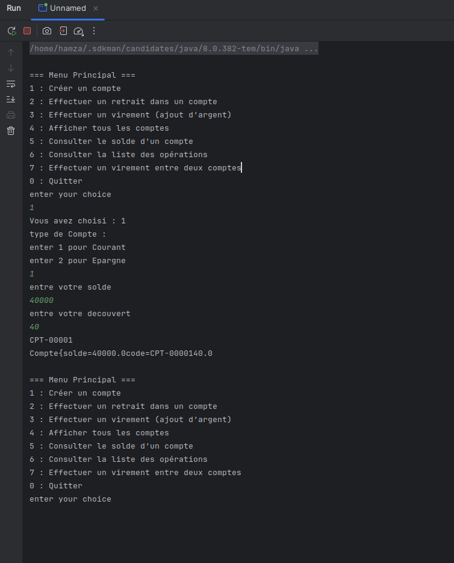

# Gestion des Comptes Bancaires - Application Java Console

# Planification 
  https://echchablihamza1-1758101303053.atlassian.net/jira/software/projects/GCB/boards/2/backlog?selectedIssue=GCB-7
  
# Diagram DE class
  https://lucid.app/lucidchart/e93244c1-696c-463f-ad84-a206b2813ebd/edit?page=0_0&invitationId=inv_60abb0e4-c01e-4818-b7d2-91f75e704ec6#

## Description du projet
Ce projet est une application console en Java 8 permettant de gérer les comptes bancaires et les opérations associées. L'application permet de créer des comptes, effectuer des retraits, des versements, des virements, et de consulter le solde ou les opérations d'un compte. Les données sont conservées en mémoire pendant l'exécution de l'application.

## Technologies utilisées
- Java 8
- Console / Scanner pour l'interface utilisateur
- Collections Java : `HashMap`, `ArrayList`
- Java Time API pour la gestion des dates

## Structure du projet
- `models` : contient les classes abstraites et concrètes des comptes et opérations (`Compte`, `CompteCourant`, `CompteEpargne`, `Operation`, `Versement`, `Retrait`)
- `controllers` : contient la logique métier et les menus (`AllFunctions`, `Menu`)
- `Main.java` : point d'entrée de l'application

## Prérequis
- JDK 8 installé
- Terminal / Console pour exécuter l'application

## Fonctionnalités
- Créer un compte courant ou épargne
- Effectuer un versement dans un compte
- Effectuer un retrait d'un compte
- Effectuer un virement entre deux comptes
- Consulter le solde d'un compte
- Consulter la liste des opérations effectuées sur un compte

## project Structure
└── src \
          ├── controllers \
           │    ├── AllFunctions.java\
           |       └── Menu.java\
           ├── Main.java\
           └── models\
               ├── Compte.java\
               ├── comptes\
               │   ├── CompteCourant.java\
               │   └── CompteEpargne.java\
               ├── Operation.java\
               └── operations\
                          ├── Retrait.java\
                          ├── variables\
                          │   ├── Destinations.java\
                          │   └── Sources.java\
                          └── Versement.java\

## ScreenShot

   
